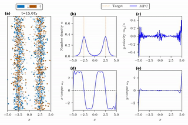

<div align="center">
  
  <p><i>MPC for splitting population and juggling densities.
	(a) shows a subset of the particles in the BD simulation.
	The particles are colored by their orientation as indicated by the legend.
	The target positions are marked by the orange lines.
	(b) shows the KDE number density in blue;
    The achieved fraction of particles with position $x<0$ is reported in blue and the target fraction in orange.
	(c) shows the input torque $\omega_x$.
	</i></p>
  
  <p><i>MPC for splitting population and controlling $y$-velocity.
	(a) shows a subset of the particles in the BD simulation.
	The particles are colored by their orientation as indicated by the legend.
	The target positions are marked by the orange lines.
	(b) shows the KDE number density in blue;
	(c) shows the KDE $y$-velocity in blue along with the target $y$-velocity in orange;
	(d) shows the input torque $\omega_x$;
	(e) shows the input torque $\omega_y$.</i></p>
</div>

This repository contains code to reproduce the results in the paper "Model Predictive Control of Active Brownian Particles" by T. Quah, J. B. Rawlings, and S. C. Takatori. The code is written in Python and uses the BD simulation package HOOMD-blue. The code is organized as follows:

### Dependencies
```
sympy
numpy
numba
scipy
matplotlib
seaborn
casadi
hoomd==3.8.1
KDEpy
mpctools
```

mpctools: https://bitbucket.org/rawlings-group/mpc-tools-casadi/src/master/

### Instructions

1. Generate initial configuration (init_cond0.py)
1. Relax initial system (Run init_cond1.py)
1. Control (*_gsd.py)
1. Visualize (*_movie.py)
